# TikTok_Claims_Classification

This is an Exploratory Data Analysis Project for Claims Classification performed on TikTok.

## Objective

The TikTok Data team seeks to develop a machine learning model to assist in the classification of claims for user submissions. In this part of the project, the data needs to be analyzed, stored, cleaned and structured prior to any model building.

## Purpose of the project

The purpose of this project is to conduct exploratory data analysis on the provided dataset. Our objective is to perform EDA on the dataset with the aim of learning more about the variables. Of particular interest is information related to what distinguishes claim videos from opinion videos.

## Goal

The goal is to explore the dataset and create visualizations.
This activity has 4 parts:

### Part 1: Imports, links, and loading

### Part 2: Data Exploration

### Part 3: Build Visualizations

### Part 4: Evaluate and share results.

# You can find my Python Codes [here](Tiktok_Claims_Classification.ipynb)
# You can find my Summarized report [here](Tiktok_claims_classification_report.pdf)

## Insights Gained : -

1)
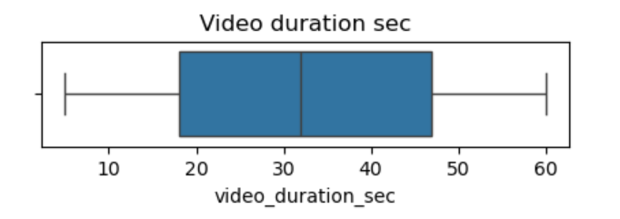       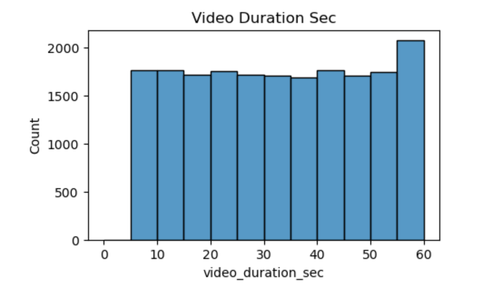

#### The following visualization shows the "Video Duration in Seconds" plotted on Boxplot and Histogram. All videos are 5-60 seconds in length, and the distribution is uniform.

2)
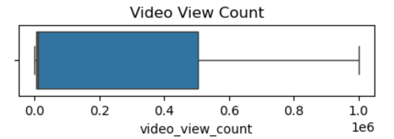       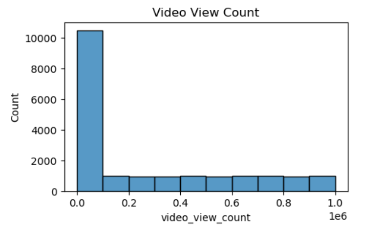

#### Visualization shows "Video View Count". This variable has a very uneven distribution, with more than half the videos receiving fewer than 100,000 views. Distribution of view counts > 100,000 views is uniform.

3)
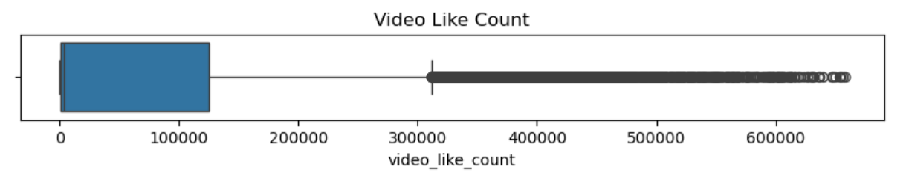       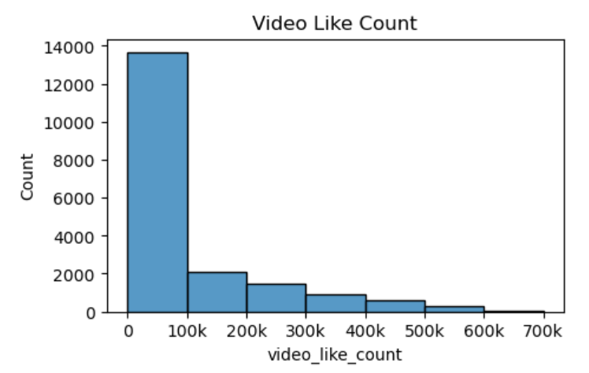

#### Visualization shows "Video Like Count". Similar to view count, there are far more videos with < 100,000 likes than there are videos with more. However, in this case, there is more of a taper, as the data skews right, with many videos at the upper extremity of like count.

4)
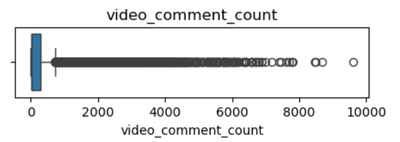       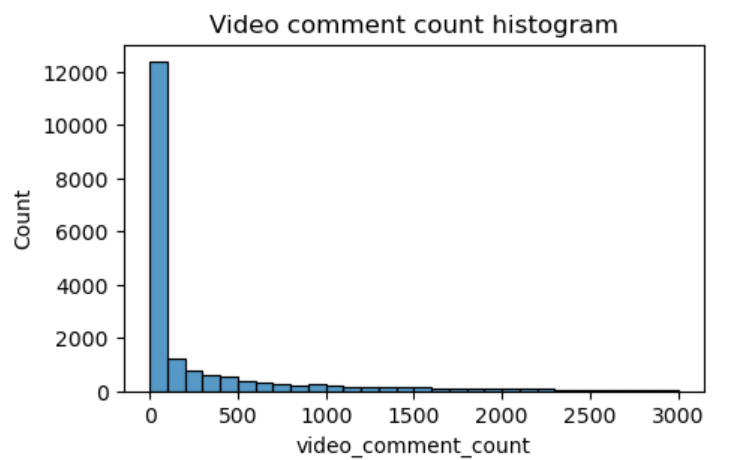

#### Visualization shows "Video Comment Count". Again, the vast majority of videos are grouped at the bottom of the range of values for video comment count. Most videos have fewer than 100 comments. The distribution is very right-skewed.

5)
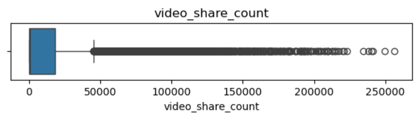       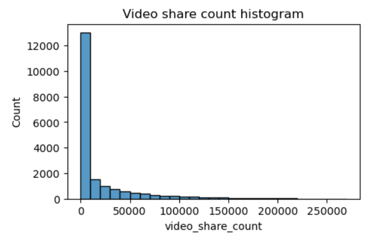

#### Visualization shows "Video Share Count". The overwhelming majority of videos had fewer than 10,000 shares. The distribution is very skewed to the right.

6)
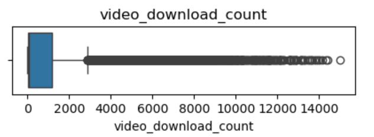       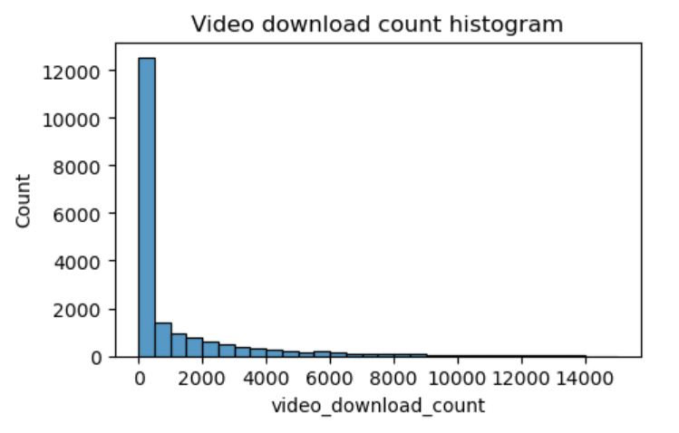

#### Visualization shows "Video Download Count". The majority of videos were downloaded fewer than 500 times, but some were downloaded over 12,000 times. Again, the data is very skewed to the right.

7)
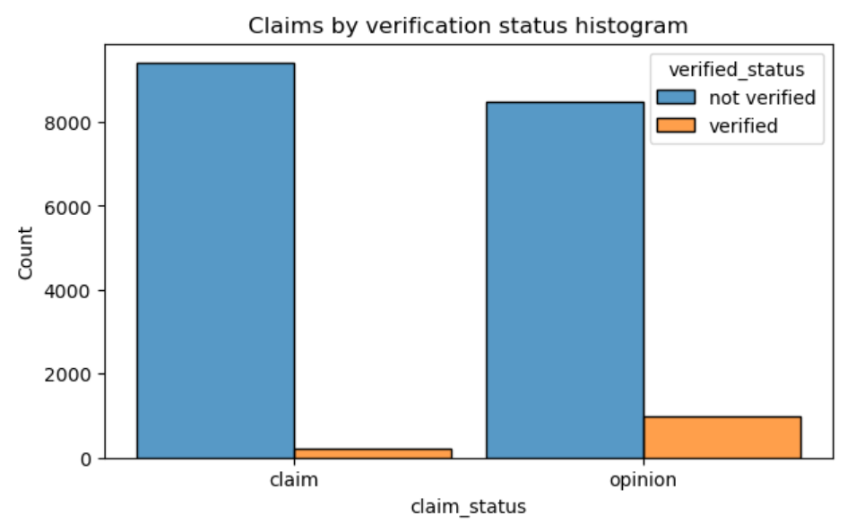

#### Visualization shows "Claim Status by Verification Status Histogram". There are far fewer verified users than unverified users, but if a user is verified, they are much more likely to post opinions.

8)
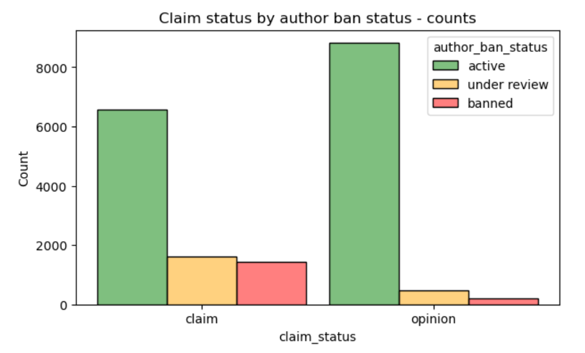

#### Visualization shows "Claim Status by Author Ban Status". For both claims and opinions, there are many more active authors than banned authors or authors under review; however, the proportion of active authors is far greater for opinion videos than for claim videos. Again, it seems that authors who post claim videos are more likely to come under review and/or get banned.

9)
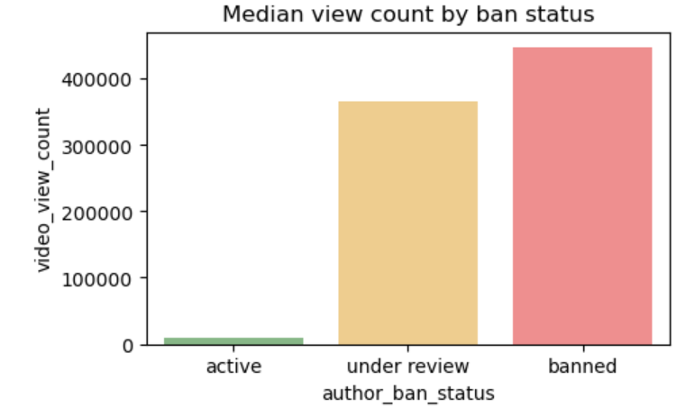

#### Visualization shows "Median View Count by Ban Status". The median view counts for non-active authors are many times greater than the median view count for active authors. Since you know that non-active authors are more likely to post claims, and that videos by non-active authors get far more views on aggregate than videos by active authors, then `video_view_count` might be a good indicator of claim status.

## Results and Evaluation : ----

* Examined Data Distribution/Spread, Count Frequencies, Mean and Median values, extreme values/Outliers, missing data and more.
* Analyzed correlation between variables, particularly between claim_status videos and others.

* Furthur investigations on distinctive characteristics that apply only to claims or only to opinions are possible.
* Furthur considerations on other variables that might be helpful in understading of data.

## Conclusion : ----

Visualizations has helped our understanding that decisions are to be made on certain considerations prior to designing a model.

